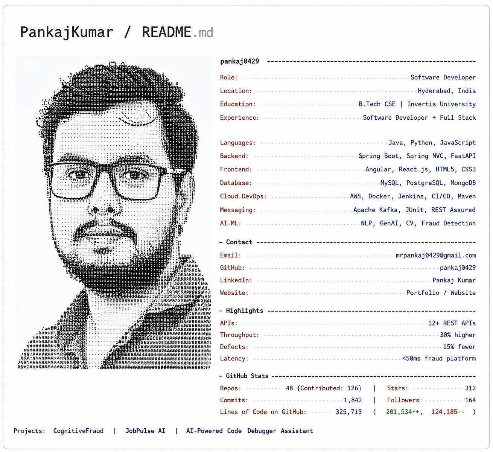

## Hi there 👋👋


[](https://git.io/typing-svg)

<p align="center">
  
</p>

[](https://www.google.com/maps/place/Hyderabad)
[](mailto:mrpankaj0429@gmail.com)
[](https://www.linkedin.com/in/pankaj-kumar-0b82a8238/)
[](https://github.com/pankajkumar952)
[](https://pankajkumar952.github.io/Portfolio/)
[](https://pankajkumar952.github.io/Website_Learning_Platform_For_Engineer/)


---

## 👨‍💻 About Me

💻 Software Developer with expertise in **Java, Spring Boot, Python, REST APIs, Microservices, and Event-Driven Architectures (Kafka)**.  
🚀 Delivered **12+ enterprise APIs**, achieving **30% higher throughput** and **15% fewer defects**.  
🧠 Skilled in **database optimization, cloud deployment, and full-stack application development**.  
🎯 Passionate about building **scalable AI-driven products** with a product engineering mindset.

---

## 🛠️ Tech Stack

<p align="center">
  
</p>

- **Languages:** Java, Python, JavaScript, TypeScript
- **Backend:** Spring Boot, Spring MVC, Spring Security, FastAPI, Hibernate, REST APIs, Microservices
- **Frontend:** Angular, React.js, HTML5, CSS3
- **Databases:** MySQL, PostgreSQL, MongoDB
- **Cloud & DevOps:** AWS, Docker, Jenkins, CI/CD, Maven
- **Messaging & Testing:** Apache Kafka, JUnit, REST Assured, Postman
- **AI/ML:** Scikit-learn, TensorFlow, PyTorch, NLP, Generative AI, Computer Vision
- **AI Tools:** GitHub Copilot, OpenAI APIs, Streamlit, Hugging Face Transformers
- **Other Tools:** Git, GitHub, Linux, JIRA, OOP, DSA, SDLC, Agile Scrum

---

## 🚀 Featured Projects

<details>
<summary><b>🎯 Student Focus Flow - Student Productivity & Focus Platform</b></summary>

<br>

- Developed a modern student productivity platform focused on improving study habits, task management, and learning consistency.
- Built an interactive and responsive React-based application with a clean, student-friendly interface.
- Implemented features for task organization, productivity tracking, and focused learning.

| Stack | Scale | Performance | Security | Impact | Repository | Live Demo |
|-------|-------|-------------|----------|--------|------------|-----------|
| React, TypeScript, Vite, Tailwind CSS | Web App | Responsive UI | Secure Client-Side Application | Improved student productivity & focus | [GitHub](https://github.com/pankajkumar952/studentfocusflow) | [Live Demo](https://student-wellness-ai-1ll2.vercel.app/) |

</details>

<details>
<summary><b>🤖 NEXUS AI ASSISTANT - Intelligent AI Virtual Assistant</b></summary>

<br>

- Built an AI-powered virtual assistant designed to understand user queries and provide intelligent conversational responses.
- Developed a responsive and interactive web interface for real-time AI-assisted user interaction.
- Integrated AI-driven workflows to create a personalized virtual assistant experience.

| Stack | Scale | Performance | Security | Impact | Repository | Live Demo |
|-------|-------|-------------|----------|--------|------------|-----------|
| JavaScript, AI APIs, React, Web Technologies | Web Application | Real-Time Interaction | Secure Client-Side Application | AI-powered personal assistance | [GitHub](https://github.com/pankajkumar952/NEXUS_AI_ASSISTANT) | [Live Demo](https://nexusassistant-liart.vercel.app/) |

</details>

<details>
<summary><b>🤖 AI Resume Analyzer</b></summary>

<br>

- Developed an AI-powered resume analysis application using **Python and Streamlit** to evaluate resumes against job descriptions.
- Implemented automated resume parsing, skill matching, ATS-oriented analysis, and personalized improvement recommendations.

| Stack | Scale | Performance | Security | Impact | Repository | Live Demo |
|-------|-------|-------------|----------|--------|------------|-----------|
| Python, Streamlit, AI APIs | Multi-Project | Automated Analysis | Secure Analysis | Improved resume quality & ATS optimization | [GitHub](https://github.com/pankajkumar952/AI_RESUME_ANALYZER) | [Live Demo](https://ai-resume-analyzer-bfew.onrender.com/) |

</details>

---

## 💼 Experience

**Software Developer Apprentice — Financial Astrology Global**  
*Mar 2025 – Feb 2026 (Remote)*

- Developed 12+ REST APIs with Java, Spring Boot, Microservices.
- Enhanced SQL queries, achieving 30% faster processing.
- Implemented JUnit & REST Assured testing, reducing defects by 15%.
- Led Agile sprints with a 6-member Scrum team.

**Full Stack Trainee — Sathya Technologies**  
*Dec 2023 – Jul 2024 (Hyderabad)*

- Built 2+ full-stack apps with Java, Spring Boot, React.js.
- Optimized MySQL queries, reducing latency by 25%.

---

## 🏆 Achievements & Certifications

| Recognition | Details |
|-------------|---------|
| Oracle Cloud | AI Foundations, Autonomous DB, Data Science, Generative AI |
| Deloitte Forage | Data Analytics Job Simulation |
| BCGX Forage | Data Science Job Simulation |
| JP Morgan Chase Forage | Software Engineering Job Simulation |
| CodeAlpha | Java Programming Quiz |
| eLitmus | pH Test — 99.57 Percentile |

---

## 🎯 Current Focus

```yaml
Learning: Advanced AI/ML Architectures
Building: Scalable Microservices & Event-Driven Systems
Exploring: Generative AI & AI-Powered Applications
Open To: Software Engineering, AI/ML, Full Stack Roles
```
